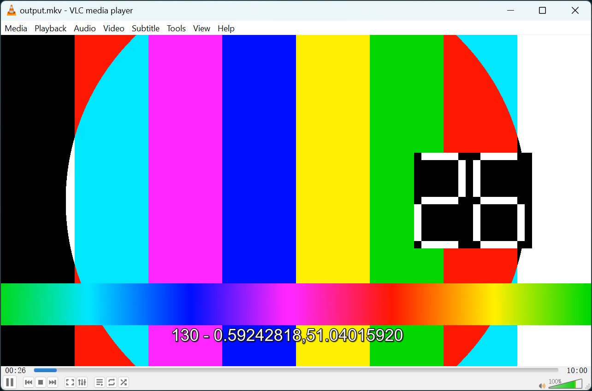

# Java WebVTT Library

🚧 Yet another Java WebVTT implementation.
This is an open-source library designed for structured creation and parsing of WebVTT (Web Video Text Tracks) files using Java.

## Features

* Structured creation of WebVTT files.
* Parse WebVTT files. (🚧 under construction)
* Validate WebVTT syntax.

## Getting Started

### Prerequisites

To use this library, you will need:
**Java 17** or higher (Because I used two features: `Record` and `Text Blocks`)

### Installing

You can add this library to your project as a dependency via Maven:

```xml
<dependency>
    <groupId>io.github.since1986</groupId>
    <artifactId>webvtt</artifactId>
    <version>1.0.0</version>
</dependency>
```

### Usage

#### simple example
Here is a simple example of how to create a WebVTT:

```java
var vtt = new VTT(
        new VTTHeader(null),
        new VTTBody(
                new VTTCue(
                        "1",
                        new CueTiming(new VTTRawTime(0L, 1L, 1L, 10L), new VTTRawTime(0L, 1L, 1L, 11L)),
                        List.of(
                                new NumberLine(1),
                                new PercentageLine(1),
                                new Position(1),
                                new Vertical(Vertical._Vertical.LR),
                                new Size(1)
                        ),
                        "test payload 1"
                ),
                new VTTComment("这是一个换行注释 > < & &gt; &lt; &amp;", true),
                new VTTCue(
                        "2",
                        new CueTiming(new VTTRawTime(0L, 1L, 1L, 11L), new VTTRawTime(9L, 1L, 1L, 20L)),
                        List.of(
                                new NumberLine(1),
                                new PercentageLine(1),
                                new Position(1),
                                new Vertical(Vertical._Vertical.LR),
                                new Size(1),
                                new Align(Align._Align.CENTER)
                        ),
                        "test payload 2"
                ),
                new VTTComment("这是一个单行的注释", false),
                new VTTComment("""
                        这是一个多
                        行注释
                        """, true)
        )
);

// System.out.println(vtt.to());
```

<br>

#### example of how to use VTTTime

Here is another example of how to use [VTTTime](src/main/java/io/github/since1986/webvtt/cue/timing/VTTTime.java). In this scenario, we aim to generate subtitles that print latitude and longitude information (which is read from a JSON file) every 200ms:

```java
ClassLoader classLoader = this.getClass().getClassLoader();
try (InputStream inputStream = classLoader.getResourceAsStream("vtt-time-test.json")) {
    var objectMapper = new ObjectMapper();
    var inputList = objectMapper.readValue(inputStream, new TypeReference<List<Map<String, String>>>() {
    });
    // Each cue spans 200ms
    var cues = new ArrayList<VTTCue>();
    var start = VTTTime.zero();
    for (int i = 0; i < inputList.size(); i++) {
        var current = inputList.get(i);
        var end = start.plusMilliseconds(200L);
        var payload = "%s - %s,%s".formatted(LocalDateTime.now().format(DateTimeFormatter.ISO_LOCAL_DATE_TIME), current.get("latitude"), current.get("longitude"));
        var cue = new VTTCue(
                String.valueOf(i),
                new CueTiming(start.to(), end.to()),
                List.of(
                        new PercentageLine(60),
                        new Size(20)
                ),
                payload
        );
        cues.add(cue);
        start = end;
    }
    var vtt = new VTT(
            new VTTHeader("测试每 200ms 打印一次字幕"),
            new VTTBody(cues.toArray(new VTTBodyItem[]{}))
    );
    // Files.writeString(Path.of("input.vtt"), vtt.to(), StandardOpenOption.CREATE, StandardOpenOption.WRITE);
```

If you want to test the subtitles in VLC, you can follow these steps:

Create a 10-minute test video: Use the command to generate a test video with a duration of 10 minutes.

```shell
ffmpeg -f lavfi -i testsrc=duration=600:size=1280x720:rate=30 -f lavfi -i sine=frequency=1000:duration=600 -c:v libx264 -c:a aac -strict experimental input.mp4
```

Combine the WebVTT file generated from the example above with the video file to create an MKV file with soft subtitles: Execute the command.

```shell
ffmpeg -i input.mp4 -i input.vtt -c copy -c:s webvtt output.mkv
```

Play the resulting MKV file in VLC to check the effects. (**NOTE** VLC does **not** support WebVTT cue settings)



**NOTE:** The subtitles generated by my library in media players like VLC cannot correctly render the VTT subtitles cue settings, and I'm not sure if the problem is on my end or with VLC.

<br>

#### example of cue settings (must use WebM)

Create a 10-minute test video: Use the command:

```shell
ffmpeg -f lavfi -i testsrc=duration=600:size=1280x720:rate=30 -f lavfi -i sine=frequency=1000:duration=600 -c:v libvpx-vp9 -b:v 2M -c:a libopus -b:a 128k output.webm
```

Combine the WebVTT file generated from the example above with the video file

```shell
ffmpeg -i input.webm -i input.vtt -c copy -c:s webvtt output.webm
```

## Contributing

Welcome contributions to this project. Please fork the repository and submit a pull request.

## License

This project is licensed under the Apache License Version 2.0 License see the [LICENSE](LICENSE) file for details.

## Acknowledgments

* Thanks to all the contributors who have helped to improve this library.

## Resources

[Web Video Text Tracks Format (WebVTT)](https://developer.mozilla.org/en-US/docs/Web/API/WebVTT_API)

[Live WebVTT Validator](https://w3c.github.io/webvtt.js/parser.html)

[Can I use WebVTT - Web Video Text Tracks](https://caniuse.com/webvtt)

[WebVTT: The Web Video Text Tracks Format](https://w3c.github.io/webvtt/)