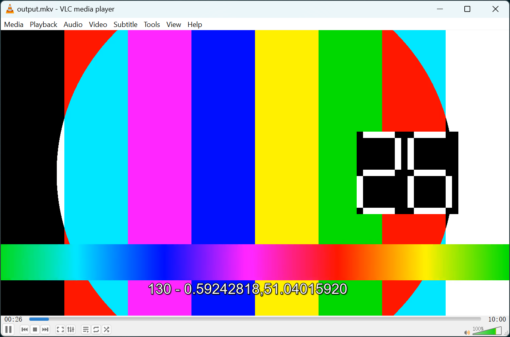

# Java WebVTT Library

🚧 Yet another Java WebVTT implementation.
This is an open-source library designed for structured creation and parsing of WebVTT (Web Video Text Tracks) files using Java.

## Features

* Structured creation of WebVTT files.
* Parse WebVTT files. (🚧 under construction)
* Validate WebVTT syntax.

## Getting Started

### Prerequisites

To use this library, you will need:
**Java 17** or higher (Because I used two features: `Record` and `Text Blocks`)

### Installing

You can add this library to your project as a dependency via Maven:

```xml

<repository>
    <id>github</id>
    <name>GitHub Packages</name>
    <url>https://maven.pkg.github.com/since1986/webvtt</url>
    <snapshots>
        <enabled>true</enabled>
    </snapshots>
</repository>

<dependency>
    <groupId>com.github.since1986</groupId>
    <artifactId>webvtt</artifactId>
    <version>1.0.2</version>
</dependency>
```

### Usage

Here is a simple example of how to create a WebVTT:

```
var vtt = new VTT(
        new VTTHeader(null),
        new VTTBody(
                new VTTCue(
                        "1",
                        new CueTiming(new Time(0, 1, 1, 10), new Time(0, 1, 1, 11)),
                        List.of(
                                new NumberLine(1),
                                new PercentageLine(1),
                                new Position(1),
                                new Vertical(Vertical._Vertical.LR),
                                new Size(1)
                        ),
                        "test payload 1"
                ),
                new VTTComment("这是一个换行注释 > < & &gt; &lt; &amp;", true),
                new VTTCue(
                        "2",
                        new CueTiming(new Time(0, 1, 1, 11), new Time(9, 1, 1, 20)),
                        List.of(
                                new NumberLine(1),
                                new PercentageLine(1),
                                new Position(1),
                                new Vertical(Vertical._Vertical.LR),
                                new Size(1),
                                new Align(Align._Align.CENTER)
                        ),
                        "test payload 2"
                ),
                new VTTComment("这是一个连行注释", false),
                new VTTComment("这是又一个连行注释", false),
                new VTTComment("""
                        这是一个多
                        行注释
                        """, true)
        )
);

// System.out.println(vtt.to());
```

Here is another example of how to use [VTTTime](src/main/java/com/github/since1986/webvtt/cue/timing/VTTTime.java). In this scenario, we aim to generate subtitles that print latitude and longitude information (which is read from a JSON file) every 200ms:

```
ClassLoader classLoader = this.getClass().getClassLoader();
try (InputStream inputStream = classLoader.getResourceAsStream("vtt-time-test.json")) {
    var objectMapper = new ObjectMapper();
    var inputList = objectMapper.readValue(inputStream, new TypeReference<List<Map<String, String>>>() {
    });
    // Each cue spans 200ms
    var cues = new ArrayList<VTTCue>();
    var start = VTTTime.zero();
    for (int i = 0; i < inputList.size(); i++) {
        var current = inputList.get(i);
        var end = start.plusMilliseconds(200L);
        var payload = "%s - %s,%s".formatted(LocalDateTime.now().format(DateTimeFormatter.ISO_LOCAL_DATE_TIME), current.get("latitude"), current.get("longitude"));
        var cue = new VTTCue(
                String.valueOf(i),
                new CueTiming(start.to(), end.to()),
                List.of(
                        new PercentageLine(60),
                        new Size(20)
                ),
                payload
        );
        cues.add(cue);
        start = end;
    }
    var vtt = new VTT(
            new VTTHeader("测试每 200ms 打印一次字幕"),
            new VTTBody(cues.toArray(new VTTBodyItem[]{}))
    );
    // Files.writeString(Path.of("input.vtt"), vtt.to(), StandardOpenOption.CREATE, StandardOpenOption.WRITE);
```

If you want to test the subtitles in VLC, you can follow these steps:

- Create a 10-minute test video: Use the command `ffmpeg -f lavfi -i testsrc=duration=600:size=1280x720:rate=30 -f lavfi -i sine=frequency=1000:duration=600 -c:v libx264 -c:a aac -strict experimental input.mp4` to generate a test video with a duration of 10 minutes.
- Combine the WebVTT file generated from the example above with the video file to create an MKV file with soft subtitles: Execute the command `ffmpeg -i input.mp4 -i input.vtt -c copy -c:s webvtt output.mkv`.
- Play the resulting MKV file in VLC to check the effects.



## Contributing

Welcome contributions to this project. Please fork the repository and submit a pull request.

## License

This project is licensed under the Apache License Version 2.0 License see the [LICENSE](LICENSE) file for details.

## Acknowledgments

* Thanks to all the contributors who have helped to improve this library.

## Resources

[Web Video Text Tracks Format (WebVTT)](https://developer.mozilla.org/en-US/docs/Web/API/WebVTT_API)